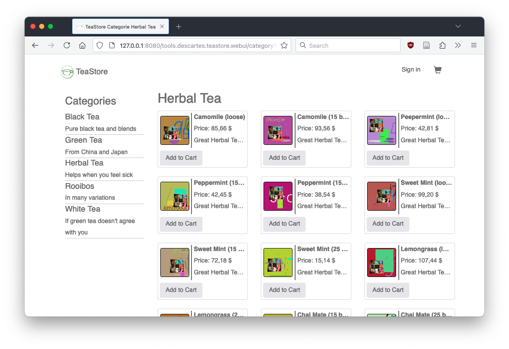

# CLUE: Cloud-native Sustainability Evaluator

- [CLUE: Cloud-native Sustainability Evaluator](#clue-cloud-native-sustainability-evaluator)
  - [0. Prerequisites](#0-prerequisites)
  - [1. Setup](#1-setup)
  - [2. Manually running a single variant (for debugging purposes)](#2-manually-running-a-single-variant-for-debugging-purposes)
  - [3. Testing the experiment setup (without building images)](#3-testing-the-experiment-setup-without-building-images)
  - [4. Running the experiments (with building and pushing images)](#4-running-the-experiments-with-building-and-pushing-images)
  - [Troubleshooting / Known Issues](#troubleshooting--known-issues)


Clue is  a benchmarking and observability framework for gathering and compiling sustainability and quality reports on changes in cloud-native applications. 

It can be used as part of your CI/CD pipeline to evaluate the impact of changes or as a standalone tool to evaluate prototypes you are working on.

The framework is designed to be extensible and can be easily integrated with existing cloud providers. We currently rely on Prometheus to collect all relevant metrics, but we are working on adding support for other monitoring tools. 
Moreover, we are currently focusing on Kubernetes as the orchestrator, so as long as your application runs on Kubernetes, you can use Clue to evaluate it. However, we are working on adding support for other environments as well.

This Readme describes the process of running experiments on different variants of the TeaStore microservice example.


## 0. Prerequisites

  * Docker, e.g. 20.10
  * Kubernetes, e.g. 1.29 (for testing purposes, [minikube](https://minikube.sigs.k8s.io/docs/) works)
    * at least one Kubernetes node running Scaphandra/[Kepler](https://sustainable-computing.io/installation/kepler-helm/), and a [NodeExporter](https://observability.thomasriley.co.uk/monitoring-kubernetes/metrics/node-exporter/). If the tracker does not find any energy data, the experiment will start, but the script will stop due to lack of usable insights
    * for the serverless variant, knative installed
    * for external power meters, connect e.g. a Tapo device (out of scope of this Readme)
  * [Helm](https://helm.sh/), e.g. v3.16
  * Python, e.g. 3.11, using pipenv in this Readme


## 1. Setup

> [!CAUTION]
> Please note that this repository also contains work in progress parts -- not all CLUE features and experiment branches that are not mentioned in the paper might be thoroughly tested.


Install Python dependencies from the Pipfile using pip (or use a virtual environment with e.g. pipenv)

```bash
pipenv install
```

Clone the system under test, i.e. the teastore. Each variant is in a separate branch.

```bash
git clone https://github.com/ISE-TU-Berlin/sustainable_teastore.git teastore
```

Start docker.

Create a kubernetes namespace for the experiments to run in. By default, this is `tea-bench`

```
kubectl create namespace tea-bench
```

In a multi-node setting, not all nodes might have the option to measure using scaphandre, so Clue ensures that only appropiate nodes are assigned with experiment pods. To simulate this for, e.g., the minikube node, apply a label:

```
kubectl label nodes minikube scaphandre=true
```

Set your Prometheus url in `exv2/experiment_list.py` (when hosting locally, use your LAN IP -- localhost will not work) and select the experiments for tests.


## 2. Manually running a single variant (for debugging purposes)

Run a variant indefinetely, e.g. baseline (see all experiment names in `exv2/experiment_list.py`)


```bash
python exv2/run.py baseline --skip-build
```

When using minikube, forward a port so you can access the TeaStore:

```bash
kubectl port-forward service/teastore-webui 8080:80 --namespace=tea-bench
```

TeaStore may run some initial tasks on startup, so make sure to wait a minute if is slow / unavailable (for experiments, this is handled through a waiting period as well)




## 3. Testing the experiment setup (without building images)

This will run the experiments from `exv2/experiment_list.py` and gather the results.
Without building images, Clue will use the latest images from the public registry, not necessarily the variant checked out locally!

```bash
python exv2/main.py --skip-build
```


## 4. Running the experiments (with building and pushing images)

If you create your own variants or make changes, the images need to be rebuilt and pushed to a registry. Currently, only managing images through docker hub is supported.

 * Adapt `exv2/experiment_environment.py` to contain your docker username
 * Make sure to run docker login

This will automatically create multiple public repositories in your account. When building images for the first time, pushing will take some time depending on your internet connection.

If all the preliminaries for data collection are installed, Clue will fetch the relevant measuremens from Prometheus and save them into the data folder. For data analysis, we provide Python notebooks seperately.


## Troubleshooting / Known Issues

 * When using docker desktop, enable in settings > advanced: *Allow the default Docker socket to be used*
 * Ensure that you have a sufficient amount of memory alocated for docker, at least 12 GB
 * Run `minikube dashboard` to monitor deployment errors, e.g. missing node labels or insufficient memory
 * The monolith app has some specific handles, e.g. a different set name. If a a set is not found, especially when skipping builds, this can cause probelems