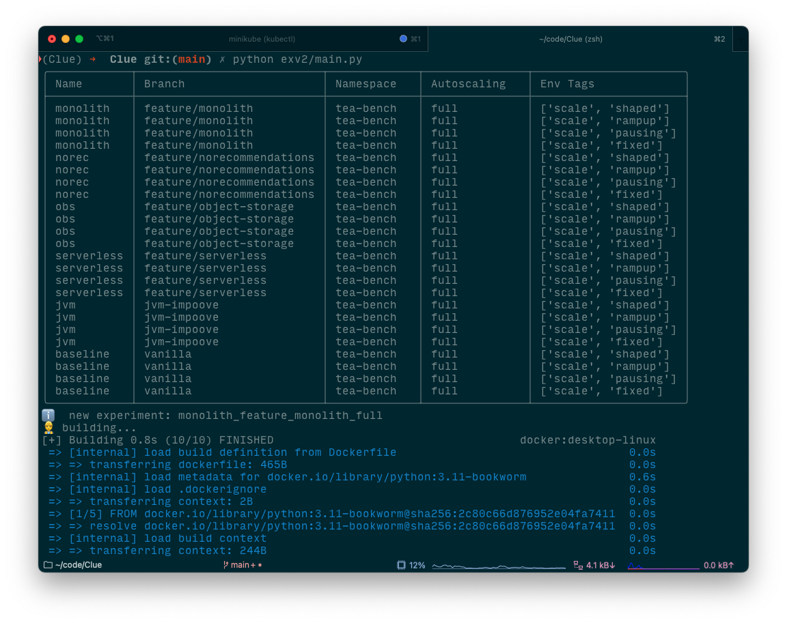

<div align="center">
  <h1 style="padding:15px;border-bottom: 0;">CLUE: Cloud-native Sustainability Evaluator</h1>
</div>

## 📢 About the Project

Clue is a benchmarking and observability framework for gathering and compiling sustainability and quality reports on changes in cloud-native applications.

It can be used as part of your CI/CD pipeline to evaluate the impact of changes or as a standalone tool to evaluate prototypes you are working on.

The framework is designed to be extensible and can be easily integrated with existing systems. We currently rely on Prometheus to collect all relevant metrics, but we are working on adding support for other monitoring tools. Moreover, we are currently focusing on Kubernetes as the orchestrator, so as long as your application runs on Kubernetes, you can use Clue to evaluate it. However, we are working on adding support for other environments as well.

## 📦 Prerequisites

- Docker, e.g. 20.10
- Kubernetes, e.g. 1.29 (for testing purposes, [minikube](https://minikube.sigs.k8s.io/docs/) works)
  - at least one Kubernetes node running Scaphandra/[Kepler](https://sustainable-computing.io/installation/kepler-helm/), and a [NodeExporter](https://observability.thomasriley.co.uk/monitoring-kubernetes/metrics/node-exporter/). If the tracker does not find any energy data, the experiment will start, but the script will stop due to lack of usable insights
  - for the serverless variant, knative installed
  - for external power meters, connect e.g. a Tapo device (out of scope of this Readme)
- [Kind](https://kind.sigs.k8s.io/), e.g. 0.29.0

## 🚀 System setup

> [!CAUTION]
> Please note that this repository also contains work in progress parts -- not all CLUE features and experiment branches that are not mentioned in the paper might be thoroughly tested.

For specific use cases, we offer a wide range of ways to deploy CLUE.

### 💻 CLUE Console

The easiest and recommended way to deploy CLUE on your local machine is to interact with our custom Web UI. To deploy all necessary CLUE container use:

```bash
docker compose up -d --build
```

CLUE Web UI should be available on the [localhost:5001](http://localhost:5001). Before running experiments, make sure to read the `CLUE Components` section.

### ⛓️ CLUE CLI

For headless deployment of CLUE we support deploying CLUE as a standalone deployer docker container.

Before running the CLI command, make sure to read the `CLUE Components` section, while CLUE will immediatelly start the experiments.

### 📦 CLUE GitHub Integration

CLUE can also be easily integrated to any existing GitHub CI-CD Pipeline, taking use of our public `clue-deployer` action.
To successfully run CLUE action, several parameters need to be provided, including the cluster config.
All collected metrics to the directory specified by the `results-path` input and uploads those files as an artifact called
`clue-results`.

The artifact is available for download from the Actions UI or it can be fetched in later jobs with `actions/download-artifact`.

```yaml
jobs:
  run-clue:
    runs-on: ubuntu-latest
    steps:
      - uses: actions/checkout@v3
      - uses: clue2-sose25/Clue2/.github/actions/clue-deployer@latest
        with:
          clue-config-path: ./clue/clue-config.yaml
          sut-config-path: ./clue/toystore-config.yaml
          image-registry: ghcr.io/clue2-sose25/sustainable_toystore
          variants-name: main
          results-path: clue_results
          kubeconfig: ${{ secrets.KUBECONFIG_B64 }}
          patch-local-cluster: "true"
```

A sample kubeconfig is provided at `.github/actions/mock-kubeconfig.yaml`. Encode the file and store the result as the `KUBECONFIG_B64` GitHub secret:

```bash
base64 -w0 .github/actions/mock-kubeconfig.yaml
```

## CLUE Components

With CLUE being a highly modular system, all of its components can be configured for the specific use case.

### 🏁 Image registry

For the deployment of the SUT, CLUE connects to the provided docker image registry, specified in the `clue-config.yaml` file (`docker_registry_address`). CLUE expects all of the container images used by the SUTs to be present in the selected registry, including the workload generator image. Finally, the tags for the images should match the name of the currently deployed variant.

By default, CLUE deploys its own unsecure, local docker registry. To use any custom public or private registry change the `clue-config.yaml` or visit the `Settings` page in our Web UI. Make sure CLUE will be able to access the images, by running `docker login` in case where authentication is needed.

### ✨ Cluster preparation

The SUT deployment and experiment will happen at the selected K8s cluster of choice. For local testing we recommend using `kind` cluster, however any cluster with following requirements should work:

- `Prometheus Node Exporter` - we recommend the Kube Prometheus Stack helm chart, which includes e.g. Node Exporter and Grafana resources.
- `Kepler` - we recommend to deploy the official `Kepler Helm chart` by following the official [Kepler docs](https://sustainable-computing.io/installation/kepler-helm/). If the `Prometheus Node Exporter` was setup before, one can skip the corresponding steps in the `Kepler` guide.

The cluster's kubeconfig can be provided in multiple ways. By default `docker-compose` mounts `~/.kube/config` into the deployer container. Alternatively you can set `KUBECONFIG_FILE` to mount a different file or pass a base64 encoded configuration via the `KUBE_CONFIG` environment variable (useful for CI environments).

If `DEPLOY_AS_SERVICE` is enabled and no kubeconfig is provided, the backend starts without a cluster connection. You can then upload the configuration from the Web UI at `/cluster`. The local cluster patching can be disabled by setting `PATCH_LOCAL_CLUSTER=false`.

1. Setting up a local `Kind` cluster

For local testing, we recommend using a `Kind` cluster, simply deployable by providing a config file. The cluster is configured to allow the usage of the local unsecure registry and to deploy the required number of nodes (at least 2) with designated node labels. Additionally, all created containers will be added to a custom `clue2` docker network. Deploy the pre-configured cluster using:

```bash
sh create-kind-cluster.sh
```

### 🧱 Built the image for the clue loadgenerator

As Clue comes with an integrated loadgenerator and developer just have to bring their config + locustfiles along with their SUT, it is required to once build the image for it and push it in the image registry.

```bash
docker compose up -d clue-loadgenerator-builder
```

### 🧱 (Optional) Build Images for the selected SUT

This step will differ based on the selected SUT. We provide a support for several SUTs listed in the `sut_configs` folder. Before running the CLUE deployer, all images of the selected SUT have to be built and stored in the specified image registry. The image registry path `docker_registry_address` can be changed in the main config (by default, CLUE uses the registry deployed in previous steps).

To build images for the selected SUT, use one of the commands listed below.

- Teastore

  ```bash
  docker compose up -d --build teastore-builder
  ```

  By default the script builds images for all experiments. To specify a single experiment you can modify the `.env` file and change the `TEASTORE_EXP_NAME` environment variable to contain the name of one of the experiments listed in the `sut_configs/teastore.yaml` file.

- Open Telemetry Shop

  ```bash
  docker compose up -d --build ots-builder
  ```

- Toystore (custom, simple SUT)
  ```bash
  docker compose up -d --build toystore-builder
  ```

Wait for the selected builder to be finished, indicated by its container showing a status `Exited`. To check if the images have been successfully stored in the registry, visit the `http://localhost:9000/v2/_catalog` page.

### 🧪 SUT Test Deployment (without running the benchmark)

For a test deployment of the SUT, without running the benchmark itself, open the `.env` file and change the `DEPLOY_ONLY` value to `true`. Make sure that all required images are present in the specified image registry. Next, run the deployer:

```bash
docker compose up -d --build clue-deployer
```

You can adjust the deployment to your needs via the environment variables inside the `.env` file, where `SUT` is the name of the SUT config inside of the `sut_configs` directory, and the `VARIANTS` is the name of the branch containing the desired experiment.

If you are deploying the Teastore locally you can forward a port so you to test and access the TeaStore:

```bash
kubectl port-forward service/teastore-webui 8080:80 --namespace=tea-bench
```

Some SUT may run some initial tasks on the startup, so before accessing the SUT, make sure to wait a minute to compensate for slow / unavailable SUTs.

### 💨 CLUE2 Deployment

To run the main CLUE2, run the task below. Make sure that all required images are present in the specified image registry.

```bash
docker compose up -d --build clue-deployer
```



### 📋 (Optional) CLUE2 Deployment with local changes

If you create your own variants or make changes to the SUT, the images need to be rebuilt and pushed to the image registry specified in the config. Make sure to run `docker login` in case authentication is needed.

If all the preliminaries for data collection are installed, Clue will fetch the relevant measuremens from Prometheus and save them into the data folder. For data analysis, we provide Python notebooks seperately.

### 💻 Troubleshooting / Known Issues

- When using docker desktop, enable in settings > advanced: _Allow the default Docker socket to be used_
- Ensure that you have a sufficient amount of memory alocated for docker, at least 12 GB
- Run `minikube dashboard` to monitor deployment errors, e.g. missing node labels or insufficient memory
- The monolith app has some specific handles, e.g. a different set name. If a a set is not found, especially when skipping builds, this can cause problems.
